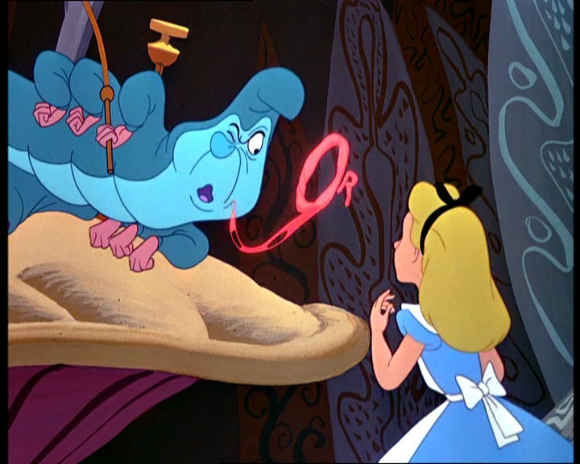

class: center, middle, inverse

# Event-driven H4ckademy

#### Javier Aguirre [@javaguirre](https://javaguirre.net)

---

class: inverse

# Who am I?



---

class: inverse

# Un poco de teoría

## TODO Hablar de eventos

---

class: inverse

# Armas

- Git
- Vagrant
- Ansible
- Go
- Gulp
- Coffeescript
- ReactJS
- Websocket

---

class: inverse

# Git

```bash
git clone https://github.com/javaguirre/h4ckademy-workshop.git
git fetch origin
git checkout -b boilerplate origin/boilerplate
```

---

class: inverse

# Entorno de desarrollo

## Dependencias

Virtualbox

```bash
sudo apt-get install virtualbox
```

[Vagrant](https://www.vagrantup.com/)

```bash
sudo apt-get install vagrant
```

[Ansible](http://www.ansible.com/)

```bash
sudo apt-get install ansible
```

---

class: inverse

# Entorno de desarrollo

## Instalación

```bash
cd h4ckademy-workshop
ansible-galaxy install (--ignore-errors) -r requirements.yml
vagrant up
```

---

class: inverse

# Entorno desarrollo

## Autocompletado Go y linter

```bash
cd h4ckademy-workshop
ansible-playbook -c local -i host \
  --tags godeps, goinstall ansible/site.yml -vv
```

---

class: inverse

# Entorno de desarrollo

## Lanzar servidor

```bash
vagrant ssh
cd hack/app
gin r app.go
```

## Lanzar compilación de archivos estáticos

```bash
vagrant ssh
cd hack
gulp
```

---

class: inverse

# Backend

[Gin framework](https://github.com/gin-gonic/gin)

```go
import (
	"log"
	"github.com/gin-gonic/gin"
)

func main() {
	engine = gin.Default()
	engine.LoadHTMLGlob("./templates/*")
	engine.Static("/public", "../public")

	engine.GET("/", func(context *gin.Context) {
		context.HTML(http.StatusOK, "index.html", gin.H{})
	})

	engine.GET("/ws", func(context *gin.Context) {
		websocketHandler(context.Writer, context.Request)
	})

	engine.Run(":3001")
}
```

---

class: inverse

# Frontend

## Coffeescript

```coffeescript
module.exports =
  class ChatConnection
    CLOSED_STATES = [WebSocket.CLOSED, WebSocket.CLOSING]
    REOPEN_TIMEOUT = 5000

    constructor: (url) ->
      @url = url
      @initWebsocket()

    initWebsocket: ->
      @client = new WebSocket(@url)
      @client.onopen = @onopen
      @client.onclose = @onclose
      @client.onmessage = @onmessage
```

---

class: inverse

# Frontend

## React

```coffeescript
ChatBox = React.createClass
  displayName: 'ChatBox'

  getInitialState: ->
    {
      messages: [],
      connection: null
    }

  componentDidMount: ->
    URL = 'ws://localhost:3000/ws';
    @setState({connection: new ChatConnection(URL)})

  render: ->
    div null,
      React.DOM.h4(key: 'header', 'chat')
      React.createElement(ChatList, messages: @state.messages)
      React.createElement(ChatInput, onSendMessage: @onHandleSendMessage)
```

---

class: inverse

# Frontend

## Browserify

```coffeescript
ChatInput = require('./chat_input')
ChatList = require('./chat_list')
ChatConnection = require('./chat_connection')
```

---

class: inverse

# Frontend

## Gulp

```javascript
gulp.task('styles', function() {
  gulp.src(STYLES_STATIC_PATH)
    .pipe(debug({title: 'styles:'}))
    .pipe(concat('style.css'))
    .pipe(gulp.dest(PUBLIC_CSS_STATIC_PATH));
});

gulp.task('watch', function() {
  livereload.listen(35729);
  gulp.watch(COFFEE_STATIC_PATH, ['scripts']);
  gulp.watch(STYLES_STATIC_PATH, ['styles']);
});

gulp.task('default', ['scripts', 'styles', 'watch']);
```

---

# Backend

TODO Backend parts

---

# Frontend

TODO Split React components
TODO Parts interaction
TODO Flux

---

# TODO Deploy DigitalOcean server websocket with Ansible
# TODO Redis
